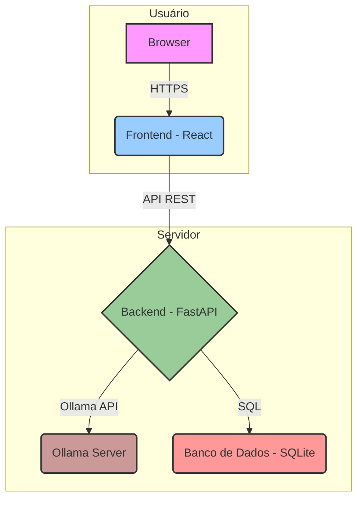

# LocalAI Assistant - Documentação Completa

**Autor:** Lucas Andre S
**Versão:** 1.0.0
**Data:** 15 de Dezembro de 2025

---

## 1. Visão Geral do Projeto

O **LocalAI Assistant** é uma aplicação full-stack de alta performance que oferece uma interface de chat premium, estilo ChatGPT/Claude, para interagir com modelos de linguagem grandes (LLMs) rodando localmente através do Ollama. O projeto foi construído com as tecnologias mais modernas de 2024/2025, focando em design, performance, e qualidade de código de nível enterprise.

A aplicação conta com um dashboard analítico para monitoramento de uso, um sistema de chat com suporte a streaming, e um painel de configurações completo, tudo isso orquestrado com Docker para fácil deploy e escalabilidade.

### 1.1. Principais Funcionalidades

- **Chat Interativo:** Interface de chat moderna e responsiva com suporte a streaming de respostas em tempo real.
- **Dashboard Analítico:** Visualização de métricas de uso, como número de conversas, mensagens, tokens utilizados, e atividade semanal.
- **Gerenciamento de Conversas:** Crie, salve, pesquise e delete conversas.
- **Configurações Avançadas:** Personalize parâmetros dos modelos de LLM (temperatura, top-p, etc.), tema da interface (dark/light), e mais.
- **Suporte a Múltiplos Modelos:** Conecte-se a qualquer modelo de LLM disponível na sua instância do Ollama.
- **Backend Robusto:** Construído com FastAPI, garantindo alta performance e documentação de API automática (Swagger).
- **Frontend Moderno:** Desenvolvido com React 19, TypeScript, e TailwindCSS, seguindo as últimas tendências de design.

### 1.2. Stack Tecnológica

| Camada | Tecnologia | Descrição |
| :--- | :--- | :--- |
| **Frontend** | React 19, TypeScript, Vite, TailwindCSS | Para uma interface de usuário reativa, tipada e estilizada de forma moderna. |
| **Backend** | FastAPI, Python 3.11, SQLAlchemy (Async) | Para uma API de alta performance, assíncrona e com acesso eficiente ao banco de dados. |
| **Banco de Dados** | SQLite (com aiosqlite) | Banco de dados leve e rápido, ideal para rodar localmente. |
| **Estado (Frontend)** | Zustand | Gerenciador de estado simples e poderoso para React. |
| **Animações** | Framer Motion | Para criar animações fluidas e modernas na interface. |
| **Containerização** | Docker, Docker Compose | Para orquestrar e gerenciar os serviços da aplicação de forma isolada e reproduzível. |

---

## 2. Arquitetura do Sistema

O sistema é dividido em dois serviços principais: o `backend` e o `frontend`, que se comunicam através de uma API RESTful. Um terceiro serviço, o `ollama`, é esperado para rodar em conjunto para prover os modelos de LLM.



### 2.1. Estrutura de Diretórios

O projeto segue uma estrutura de monorepo, separando claramente as responsabilidades de cada parte da aplicação.

```
localai-assistant/
├── backend/         # Aplicação FastAPI
├── frontend/        # Aplicação React
├── screenshots/     # Imagens da aplicação
├── docker-compose.yml # Orquestração dos serviços
├── README.md        # Documentação principal
└── DOCUMENTATION.md # Este arquivo
```

---

## 3. Detalhes do Backend (FastAPI)

O backend é responsável por toda a lógica de negócio, comunicação com o banco de dados e com o serviço do Ollama.

### 3.1. Endpoints da API

A API é versionada (`/api/v1`) e segue os padrões REST. A documentação interativa (Swagger) está disponível em `/docs` quando o backend está rodando.

- `POST /api/v1/chat/completions`: Envia uma mensagem para o LLM e retorna a resposta (com ou sem streaming).
- `GET /api/v1/conversations`: Lista todas as conversas.
- `POST /api/v1/conversations`: Cria uma nova conversa.
- `GET /api/v1/conversations/{uuid}`: Obtém os detalhes e mensagens de uma conversa específica.
- `DELETE /api/v1/conversations/{uuid}`: Deleta uma conversa.
- `GET /api/v1/models`: Lista os modelos de LLM disponíveis no Ollama.
- `GET /api/v1/prompts`: Lista os prompts de sistema pré-definidos.
- `GET /api/v1/conversations/stats/dashboard`: Retorna as estatísticas para o dashboard.

### 3.2. Módulos Principais

- **`main.py`**: Ponto de entrada da aplicação FastAPI. Carrega as rotas e configurações.
- **`routers/`**: Define os endpoints da API, separando-os por recurso (chat, conversations, etc.).
- **`services/`**: Contém a lógica de negócio. O `conversation_service` gerencia o CRUD de conversas e mensagens, enquanto o `llm_service` se comunica com o Ollama.
- **`models/`**: Define as tabelas do banco de dados usando SQLAlchemy (Conversation, Message, Analytics).
- **`schemas/`**: Define os schemas Pydantic para validação de dados de entrada e saída da API.
- **`core/`**: Configurações centrais, como a conexão com o banco de dados (`database.py`).

---

## 4. Detalhes do Frontend (React)

O frontend oferece uma experiência de usuário rica e interativa, construída com as melhores práticas de desenvolvimento web.

### 4.1. Componentes Premium

- **`Chat.tsx`**: O coração da interface, este componente gerencia a exibição de mensagens, o input do usuário, e o rendering de respostas em streaming. Utiliza `ReactMarkdown` para formatar o conteúdo e `react-syntax-highlighter` para code blocks.

  

- **`Dashboard.tsx`**: Um painel de controle visualmente impressionante que exibe estatísticas de uso em tempo real. Utiliza `recharts` para criar gráficos interativos de área, pizza e barras.

  

- **`Settings.tsx`**: Painel de configurações completo onde o usuário pode ajustar todos os aspectos da aplicação, desde o modelo de LLM e seus parâmetros até o tema da interface.

  

- **`Sidebar.tsx`**: Barra lateral de navegação que lista as conversas recentes e permite o acesso rápido ao dashboard e configurações.

### 4.2. Gerenciamento de Estado (Zustand)

O estado global da aplicação é gerenciado pelo Zustand, uma solução leve e eficiente. O store (`lib/store.ts`) centraliza informações como:

- Estado da sidebar (aberta/fechada).
- Visão atual (chat, dashboard, settings).
- Lista de conversas e ID da conversa ativa.
- Configurações do usuário.
- Estado de geração de respostas (carregando, streaming).

### 4.3. Comunicação com a API

O arquivo `lib/api.ts` centraliza todas as chamadas para o backend. Ele utiliza `axios` para requisições HTTP padrão e a `Fetch API` nativa para lidar com as respostas em streaming do endpoint de chat.

---

## 5. Setup e Instalação

Para rodar o projeto localmente, você precisa ter o **Docker** e o **Docker Compose** instalados, além de uma instância do **Ollama** rodando e acessível pela rede.

1.  **Clone o Repositório:**
    ```bash
    git clone https://github.com/lucasandre16112000-png/localai-assistant.git
    cd localai-assistant
    ```

2.  **Configure as Variáveis de Ambiente:**
    Copie o arquivo `.env.example` para `.env` e ajuste a variável `OLLAMA_API_BASE_URL` para apontar para a sua instância do Ollama.
    ```bash
    cp .env.example .env
    ```

3.  **Inicie os Serviços com Docker Compose:**
    Este comando irá construir as imagens do backend e do frontend e iniciar os containers.
    ```bash
    docker-compose up -d --build
    ```

4.  **Acesse a Aplicação:**
    Abra seu navegador e acesse `http://localhost:3000`.

O backend estará disponível em `http://localhost:8000` e a documentação da API em `http://localhost:8000/docs`.
