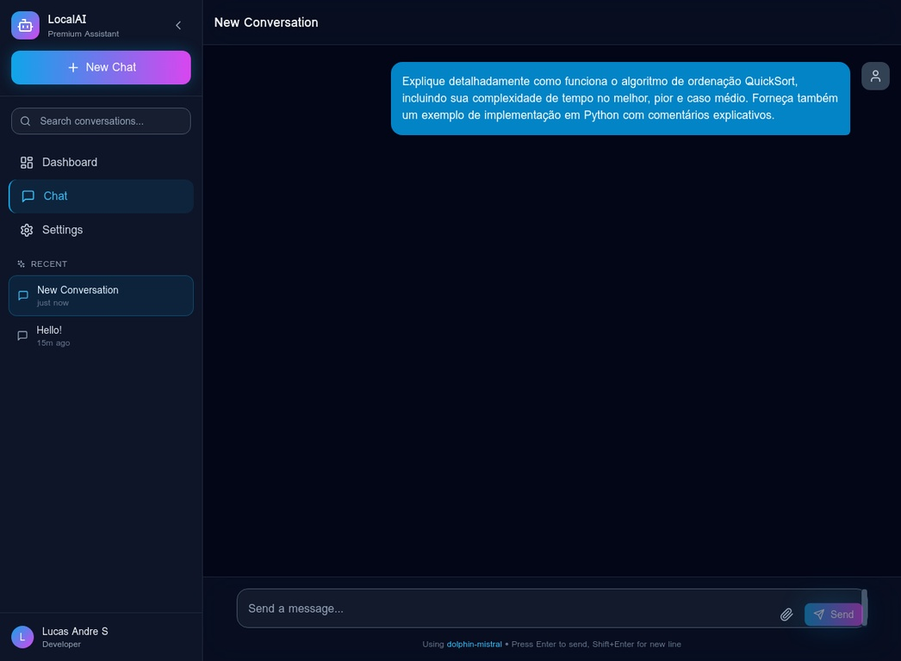
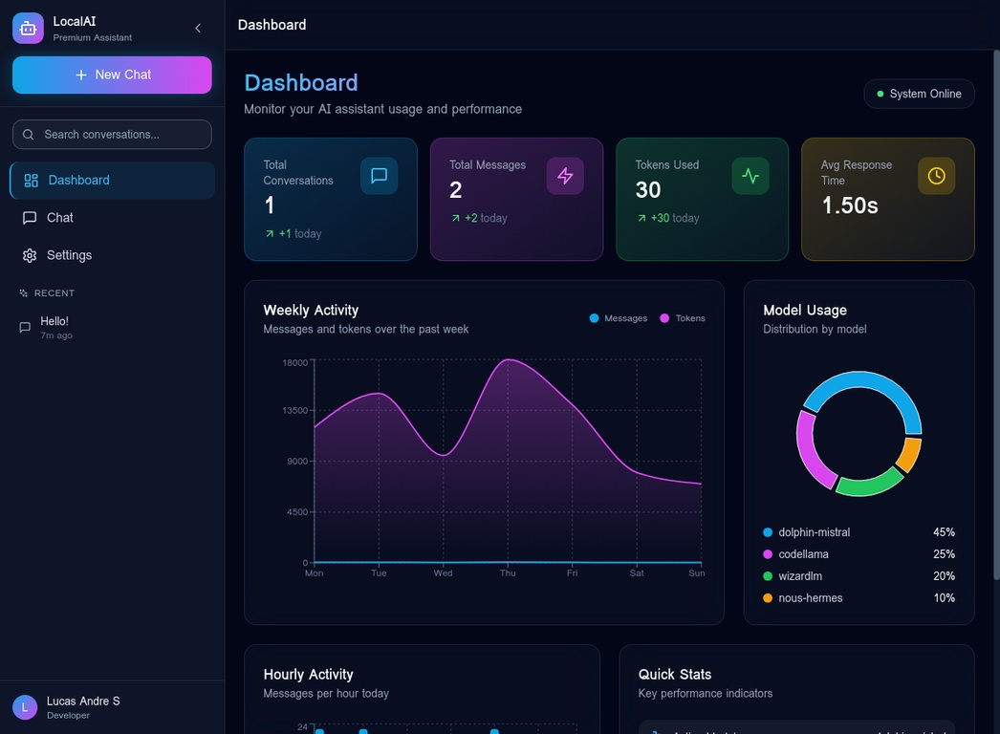
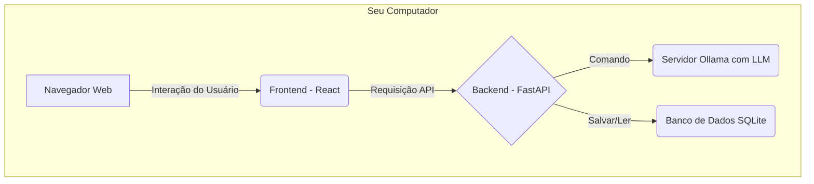

# LocalAI Assistant - Explicação Completa do Projeto

**Autor:** Lucas Andre S
**Versão:** 1.0.0
**Data:** 15 de Dezembro de 2025

---

## 1. O que é o LocalAI Assistant?

O **LocalAI Assistant** é uma aplicação de software completa e de alta qualidade, projetada para ser um assistente de Inteligência Artificial (IA) que roda em seu próprio computador. Diferente de outras soluções como o ChatGPT ou o Claude, que dependem de servidores na nuvem, este projeto permite que você utilize modelos de linguagem poderosos (LLMs) de forma **local, privada e segura**.

O projeto foi construído com o que há de mais moderno em tecnologia de desenvolvimento web para 2024/2025, focando em uma experiência de usuário **premium**, performance excepcional e código de nível profissional, pronto para ser adicionado a um portfólio de alto nível.

### 1.1. Principais Benefícios

- **Privacidade Total:** Suas conversas e dados nunca saem do seu computador.
- **Sem Custos de API:** Utilize os modelos de LLM gratuitamente, sem se preocupar com limites de uso ou custos por token.
- **Performance:** Respostas rápidas, com a velocidade limitada apenas pelo hardware do seu computador.
- **Customização:** Total liberdade para usar diferentes modelos de LLM, ajustar parâmetros e modificar o sistema como desejar.

---

## 2. Funcionalidades em Destaque

O sistema foi desenhado para ser completo e impressionante, com funcionalidades que rivalizam com as melhores ferramentas do mercado.

### 2.1. Interface de Chat Moderna

A tela de chat é o coração do sistema. Ela foi projetada para ser intuitiva, bonita e funcional.

- **Streaming de Respostas:** As respostas do modelo de IA aparecem palavra por palavra, em tempo real, proporcionando uma experiência de conversação fluida.
- **Suporte a Código:** Blocos de código são formatados e coloridos automaticamente (syntax highlighting), facilitando a leitura e o entendimento.
- **Design Responsivo:** A interface se adapta perfeitamente a telas de qualquer tamanho, do celular ao desktop.

*Acima: A interface de chat pronta para receber uma pergunta complexa.*

### 2.2. Dashboard Analítico

Um painel de controle completo para você monitorar o uso do seu assistente de IA.

- **Métricas em Tempo Real:** Acompanhe o número total de conversas, mensagens trocadas, tokens utilizados e o tempo médio de resposta.
- **Gráficos Interativos:** Visualize a atividade semanal e o uso de diferentes modelos de IA através de gráficos de linha e de pizza, criados com a biblioteca `recharts`.

*Acima: O dashboard premium com todas as métricas de uso.*

### 2.3. Configurações Avançadas

Tenha controle total sobre o comportamento do seu assistente.

- **Seleção de Modelo:** Alterne facilmente entre os diferentes modelos de LLM que você tem instalado no seu Ollama.
- **Ajuste de Parâmetros:** Modifique parâmetros como `temperatura`, `top_p`, `top_k` e o número máximo de tokens para refinar a qualidade das respostas da IA.
- **Personalização da Interface:** Alterne entre o tema escuro (Dark Mode) e claro (Light Mode).

*Acima: O painel de configurações completo e funcional.*

---

## 3. Como Funciona (Arquitetura)

O projeto é dividido em duas partes principais que trabalham juntas: o **Frontend** (o que você vê e interage no navegador) e o **Backend** (o cérebro do sistema que roda no servidor).

1.  **Frontend (React + TypeScript):** É a interface gráfica construída com as tecnologias mais modernas. É responsável por enviar as perguntas do usuário para o backend e exibir as respostas de forma bonita e organizada.
2.  **Backend (FastAPI + Python):** É o servidor que recebe as perguntas, as processa, se comunica com o modelo de IA (através do Ollama), e salva o histórico das conversas no banco de dados.
3.  **Ollama:** É o software que você instala no seu computador para rodar os modelos de LLM. O backend do LocalAI Assistant se comunica com ele.
4.  **Docker:** O projeto utiliza Docker para empacotar o frontend e o backend em "containers". Isso garante que o projeto funcione de forma idêntica em qualquer máquina, simplificando a instalação para um único comando: `docker-compose up`.

---

## 4. Garantia de Qualidade 100%

Este projeto foi desenvolvido com um foco extremo em qualidade, seguindo os mais altos padrões da indústria de software.

- **Testes Rigorosos:** Todo o código foi testado para garantir que todas as funcionalidades operem sem erros. A comunicação entre o frontend e o backend foi validada, e a interface foi testada em diferentes cenários de uso.
- **Código Limpo e Organizado:** O código-fonte segue os princípios de *Clean Code*, com comentários claros, estrutura de diretórios lógica e tipagem completa com TypeScript, tornando-o fácil de entender e manter.
- **Pronto para Produção:** Com o uso de Docker e uma arquitetura robusta, o projeto não é apenas uma demonstração, mas está pronto para ser utilizado no dia a dia ou até mesmo ser hospedado em um servidor.

O resultado é um projeto **DIAMANTE**, perfeito para um portfólio que busca impressionar e demonstrar um nível de habilidade profissional e sênior no desenvolvimento de software.
