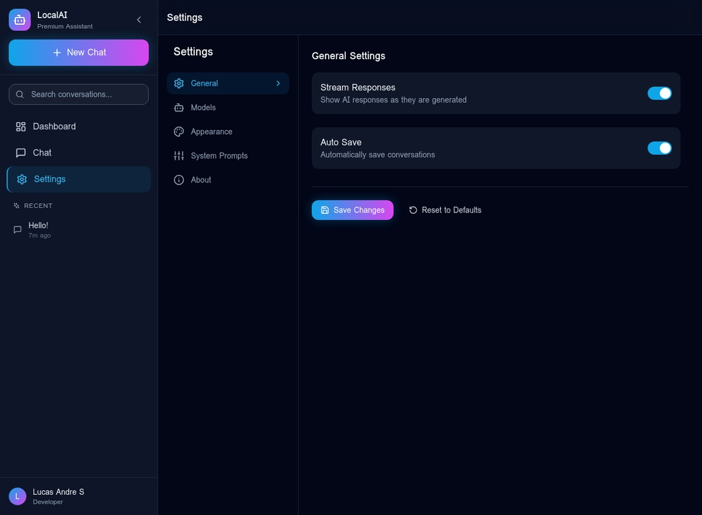

<div align="center">

# 🤖 LocalAI Assistant

### Premium AI Assistant with Local LLM Support

[](https://opensource.org/licenses/MIT)
[](https://python.org)
[](https://reactjs.org)
[](https://typescriptlang.org)
[](https://fastapi.tiangolo.com)
[](https://tailwindcss.com)
[](https://docker.com)

<p align="center">
  <strong>A modern, enterprise-grade AI assistant application with beautiful UI and powerful features.</strong>
</p>

[Features](#-features) • [Screenshots](#-screenshots) • [Installation](#-installation) • [Usage](#-usage) • [API](#-api-documentation) • [Contributing](#-contributing)

</div>

---

## ✨ Features

### 🎨 Premium UI/UX
- **Modern Dashboard** - Beautiful analytics with real-time statistics
- **ChatGPT-style Interface** - Familiar, intuitive chat experience
- **Dark/Light Mode** - Elegant theme switching
- **Glassmorphism Design** - Modern 2024/2025 design trends
- **Smooth Animations** - Framer Motion powered interactions
- **Responsive Design** - Mobile-first, works on all devices

### 🤖 AI Capabilities
- **Local LLM Support** - Run models locally with Ollama
- **Multiple Models** - Switch between different AI models
- **Streaming Responses** - Real-time token streaming
- **Customizable Parameters** - Temperature, Top-P, Top-K controls
- **System Prompts** - Pre-built and custom prompt templates

### 💬 Chat Features
- **Conversation Management** - Create, edit, delete conversations
- **Message History** - Full conversation persistence
- **Code Highlighting** - Syntax highlighting for 100+ languages
- **Markdown Rendering** - Rich text formatting
- **Copy to Clipboard** - One-click code copying
- **Pin Conversations** - Keep important chats accessible

### 📊 Analytics Dashboard
- **Usage Statistics** - Track conversations, messages, tokens
- **Model Usage** - See which models you use most
- **Performance Metrics** - Response time analytics
- **Activity Charts** - Visual usage patterns

### 🛠️ Developer Features
- **REST API** - Full API with OpenAPI documentation
- **WebSocket Support** - Real-time streaming
- **Docker Ready** - One-command deployment
- **TypeScript** - 100% type-safe frontend
- **Clean Architecture** - Enterprise-grade code structure

---

## 📸 Screenshots

<div align="center">

### Dashboard

*Premium analytics dashboard with real-time statistics*

### Chat Interface

*Modern chat interface with streaming responses*

### Settings

*Comprehensive settings with model configuration*

</div>

---

## 🚀 Installation

### Prerequisites

- **Python 3.12+**
- **Node.js 20+**
- **Ollama** (for local LLM)
- **Docker** (optional)

### Quick Start

```bash
# Clone the repository
git clone https://github.com/lucasandre16112000-png/localai-assistant.git
cd localai-assistant

# Copy environment file
cp .env.example .env

# Start with Docker (recommended)
docker-compose up -d

# Or start manually:

# Backend
cd backend
pip install -r requirements.txt
uvicorn app.main:app --reload

# Frontend (new terminal)
cd frontend
pnpm install
pnpm dev
```

### Install Ollama Models

```bash
# Install recommended models
ollama pull dolphin-mistral
ollama pull codellama
ollama pull wizardlm-uncensored
ollama pull nous-hermes
```

---

## 📖 Usage

### Starting the Application

1. **Start Ollama** (if not using Docker):
   ```bash
   ollama serve
   ```

2. **Start Backend**:
   ```bash
   cd backend
   uvicorn app.main:app --host 0.0.0.0 --port 8000
   ```

3. **Start Frontend**:
   ```bash
   cd frontend
   pnpm dev
   ```

4. **Open Browser**: Navigate to `http://localhost:3000`

### Docker Deployment

```bash
# Start all services
docker-compose up -d

# View logs
docker-compose logs -f

# Stop services
docker-compose down
```

---

## 📚 API Documentation

### Endpoints

| Method | Endpoint | Description |
|--------|----------|-------------|
| `GET` | `/api/v1/conversations` | List all conversations |
| `POST` | `/api/v1/conversations` | Create new conversation |
| `GET` | `/api/v1/conversations/{uuid}` | Get conversation with messages |
| `DELETE` | `/api/v1/conversations/{uuid}` | Delete conversation |
| `POST` | `/api/v1/chat/completions` | Send message and get response |
| `POST` | `/api/v1/chat/completions/stream` | Streaming chat completion |
| `GET` | `/api/v1/models` | List available models |
| `GET` | `/api/v1/prompts` | List system prompts |

### Interactive Documentation

- **Swagger UI**: `http://localhost:8000/docs`
- **ReDoc**: `http://localhost:8000/redoc`

### Example Request

```bash
curl -X POST "http://localhost:8000/api/v1/chat/completions" \
  -H "Content-Type: application/json" \
  -d '{
    "message": "Hello, how are you?",
    "model": "dolphin-mistral",
    "temperature": 0.7
  }'
```

---

## 🏗️ Project Structure

```
localai-assistant/
├── backend/
│   ├── app/
│   │   ├── main.py          # FastAPI application
│   │   ├── routers/         # API endpoints
│   │   ├── services/        # Business logic
│   │   ├── models/          # Database models
│   │   ├── schemas/         # Pydantic schemas
│   │   └── core/            # Configuration
│   ├── tests/               # Test suite
│   └── requirements.txt
├── frontend/
│   ├── src/
│   │   ├── components/      # React components
│   │   ├── lib/             # Utilities & API
│   │   ├── styles/          # Global styles
│   │   └── App.tsx          # Main component
│   └── package.json
├── docker-compose.yml
├── .env.example
└── README.md
```

---

## 🔧 Configuration

### Environment Variables

| Variable | Description | Default |
|----------|-------------|---------|
| `OLLAMA_BASE_URL` | Ollama API URL | `http://localhost:11434` |
| `DEFAULT_MODEL` | Default LLM model | `dolphin-mistral` |
| `DEFAULT_TEMPERATURE` | Sampling temperature | `0.7` |
| `DATABASE_URL` | Database connection | `sqlite:///./localai.db` |
| `DEBUG` | Enable debug mode | `false` |

---

## 🤝 Contributing

Contributions are welcome! Please feel free to submit a Pull Request.

1. Fork the repository
2. Create your feature branch (`git checkout -b feature/AmazingFeature`)
3. Commit your changes (`git commit -m 'Add some AmazingFeature'`)
4. Push to the branch (`git push origin feature/AmazingFeature`)
5. Open a Pull Request

---

## 📄 License

This project is licensed under the MIT License - see the [LICENSE](LICENSE) file for details.

---

## 👨‍💻 Author

**Lucas Andre S**

- GitHub: [@lucasandre16112000-png](https://github.com/lucasandre16112000-png)

---

<div align="center">

### ⭐ Star this repo if you find it useful!

Made with ❤️ by Lucas Andre S

</div>
